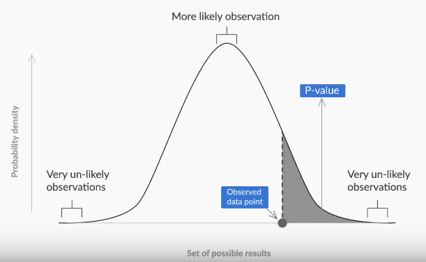
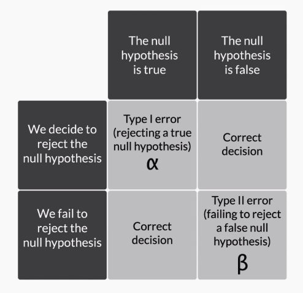
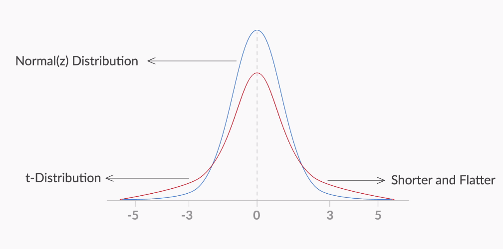

# Hypothesis Testing

## Concepts

### Null and Alternate

Hypothesis Testing starts with the formulation of these two hypotheses:

**Null hypothesis** (H₀): The status quo

**Alternate hypothesis** (H₁): The challenge to the status quo

| Hypothesis | Symbols |
| ---------- | ------- |
| Null       | =, ≤, ≥ |
| Alternate  | ≠, >, < |

### Decision Making

You can tell the type of the test and the position of the critical region on the basis of the ‘sign’ in the alternate hypothesis.

| Sign in H₁ | TestType          | Rejection Region           |
| ---------- | ----------------- | -------------------------- |
| ≠          | Two-tailed test   | both sides of distribution |
| <          | Lower-tailed test | left side of distribution  |
| >          | Upper-tailed test | right side of distribution |

## Z-Test

Relies on Population charecteristics such as standard deviation $\sigma$.

### Critical Value Method

**Note:**

1. First, you define a new quantity called α, which is also known as the significance level for the test. It refers to the proportion of the sample mean lying in the critical region. For this test, α is taken as 0.05 (or 5%).

2. Then, you calculate the cumulative probability of UCV from the value of $\alpha$, which is further used to find the z-critical value (Zc) for UCV.

**Steps:**

1. Calculate the value of Zċ from the given value of $\alpha$ (significance level). Take it as 5% if not specified in the problem.
   using the Formula 1 - $\alpha$ for one tailed and 1 - $\frac{\alpha}{2}$ for two tailed.

2. Calculate the critical values (UCV and LCV) from the value of Zċ.
   using Formula **μ ± Zc x (σ/​√N​)**

3. Make the decision on the basis of the value of the sample mean ${\bar{x}}$ with respect to the critical values (UCV AND LCV).

### P-Value Method

The higher the p-value, the higher is the probability of failing to reject a null hypothesis. And the lower the p-value, the higher is the probability of the null hypothesis being rejected.

After formulating the null and alternate hypotheses, the steps to follow in order to make a decision using the p-value method are as follows:

1. Calculate the value of the z-score for the sample mean point on the distribution.
   Formula
   Z = $\frac{\bar x - \mu}{\frac{\sigma}{\sqrt{n}}}$

2. Calculate the p-value from the cumulative probability for the given z-score using the z-table.

3. Make a decision on the basis of the p-value (multiply it by 2 for a two-tailed test) with respect to the given value of α (significance value).
   reject or fail to reject based on p-value < α or p-value > α

### Types of Errors

1. A type I-error, represented by α, occurs when you reject a true null hypothesis.

2. A type-II error, represented by β, occurs when you fail to reject a false null hypothesis.

The power of any hypothesis test is defined by 1 - β.

### T distribution

aka **Student - T distribution** is similar to normal distribution but shotter and flatter.
Used when we don't have propulation characteristics such as standard deviation $\sigma$.

The most important use of the T-distribution is that you can approximate the value of the **standard deviation of the population (σ)** from the **sample standard deviation (s)**.

Degrees of Freedom (df) = Sample Size(n) -1

Setps

1.

### Two-sample mean test

### Two-sample proportion test

### A/B testing

### Industry relevance
