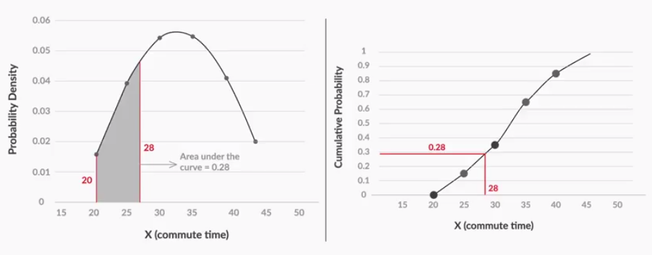
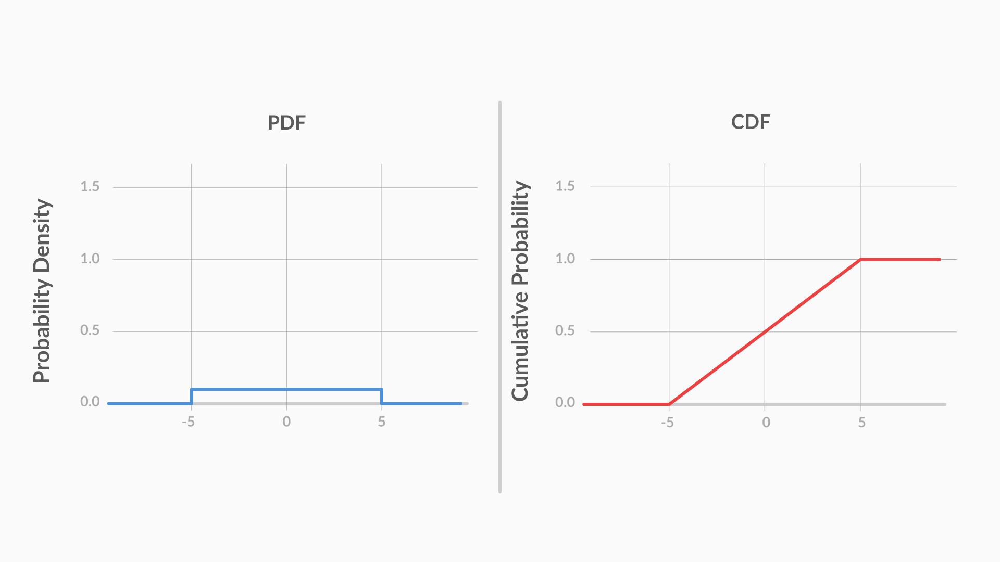
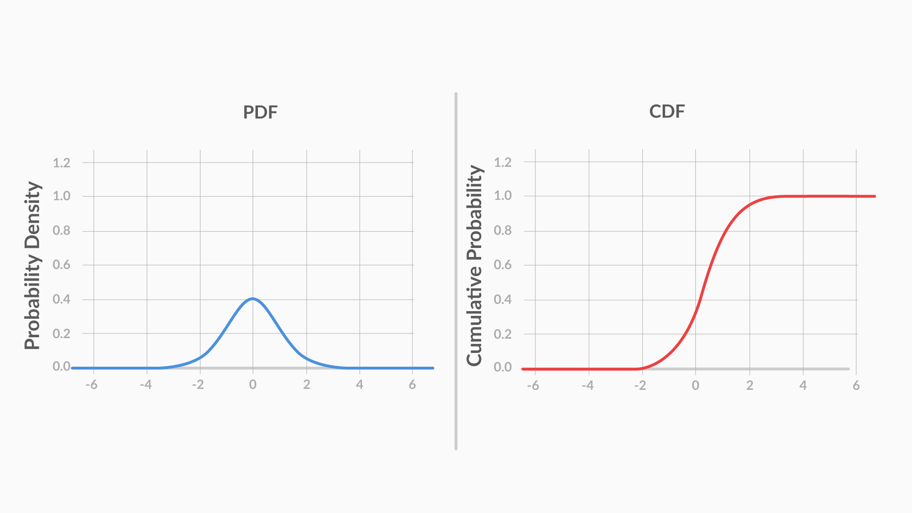
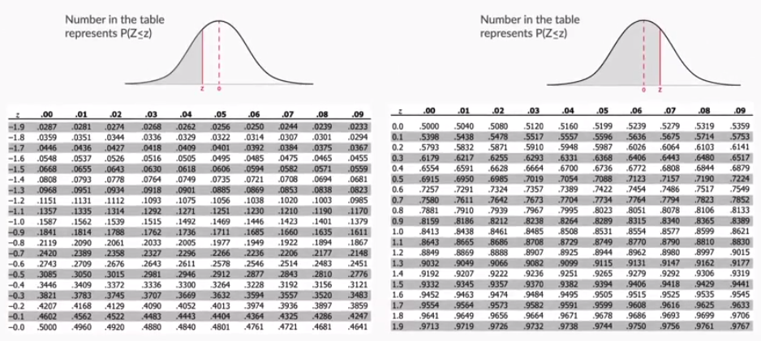
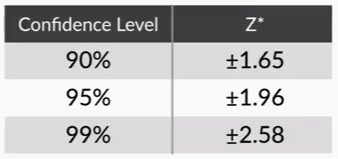

# Inferential Statistics

## Permutations

### order matters

1. Arrangement of n distinct object is n!
2. selecting r object from a total of n objects nPr = n!/(n-r)!
3. **keywords:** order/arrange

## Combinations

### order doesn't matter

1. select r objects from a total of n objects nCr = n!/(n-r)!r! = nPr/r!
2. **keywords:** pick/choose

## Probability

1. Probability = (No. of desired outcomes)/(Total outcomes)
2. Total Probability = 1
3. Probability of an event rangs from 0-1

### Experiment

1. Deterministic
2. Random

### Sample Space

1. Given a random experiment K, a set of all possible outcomes for K represents the sample space

### Event

1. Subset of the sample space

## Types of Events

1. Independent events
2. Disjoint or mutually exclusive events (complement rule of probability applies) P(A)+P(A')=1

## Rules of Probability

1. Addition P(A u B)=P(A)+P(B)-P(A n B) or P(A)+P(B ) if A and B are disjoint **keywords:** OR to denote the relationship between events

2. Multiplication P(A and B) = P(A)\*P(B) if A and B are independent events extending the rule P(A and B and C and D) = P(A)*P(B)*P(C)\*P(D) **keywords:** AND to denote the relationship between events

### Random Variables

### Probability Distribution

Either Tabular or Bar Chart

### Expected Value

it's average value you get after the experiment has been conducted an infinite number of times

X can take x1, x2, ... xn

EV = x1\*P(X = x1) + x2\*P(X = x2) ... + xn\*P(X = xn)

## Discrete Probability Distributions

### Binomial Probability Distributions

P(X=r)=nCr(p)r(1−p)n−r

1. The total number of trials is fixed at n.

2. Each trial is binary, i.e., it has only two possible outcomes: success or failure.

3. Probability of success is the same in all trials, denoted by p.

### Cumulative Probability Distribution

cumulative probability of X, denoted by F(x), is defined as the probability of the variable being less than or equal to x.

F(x) = P(X<=x)

P(X>x) = 1-P(X<=x)

### Continuous Probability Distributions

deals with continuous variables and leverages CDF Cumulative Distribution Function

P(X ≤ x) = P(X < x) + P(X = x) where X is a continuous variable and probability of getting an exact value is zero. which implies P(X=x)=0

**Cumulative Distribution Function**, is a distribution that plots the cumulative probability of X against X.

**Probability Density Function**, however, is a function in which the area under the curve gives you the cumulative probability.

The major difference between a PDF and a CDF is that in a CDF, you can find the cumulative probability directly by checking the value at x. However, for a PDF, you need to find the area under the curve between the lowest value and x to find the cumulative probability.

#### Uniform Distribution

The **PDF** clearly shows uniformity, as the probability density’s value remains constant for all possible values. However, the **CDF** does not show any trends that help you identify quickly that the variable is uniformly distributed.

#### Symetric Distribution

#### Normal Distribution aka Gaussian Distrubution

Normally distributed data follows the 1-2-3 rule. This rule states that there is a:

1. 68% probability of the variable lying within 1 standard deviation of the mean,

2. 95% probability of the variable lying within 2 standard deviations of the mean, and

3. 99.7% probability of the variable lying within 3 standard deviations of the mean.

#### Standard Normal Distribution

**standardised random variable**

Z = $\frac{X − μ}{σ}$

F(Z)=(1/√2π)∫Z−∞e−t2/2dt

### Central Limit Theorem

Properties of a sampling distribution of the mean:

1. Sampling distribution’s mean ($μ_{\bar{X}}$)= Population mean (μ)

2. Sampling distribution’s standard deviation
   (**Standard error**) = $\frac{σ}{√n}$, where σ is the population’s standard deviation and n is the sample size

3. For n > 30, the sampling distribution becomes a normal distribution.

Recall that you are doing sampling because you want to find the population mean, albeit in the form of an interval. The three steps to follow are as follows:

1. First, take a sample of size n.

2. Then, find the mean $\bar{X}$ and standard deviation S of this sample.

3. Now, you can say that for a y% confidence level, the confidence interval for the population mean (μ) is given by $(\bar{X}-\frac{Z^*S}{\sqrt{n}}, \bar{X}+\frac{Z^*S}{\sqrt{n}})$.

you cannot finish step 3 without the CLT. The CLT lets you assume that the sample mean would be normally distributed, with mean \mu and standard deviation $\frac{\sigma}{\sqrt{n}}$ (approx. $\frac{S}{\sqrt{n}}$).

### Additonal Notes

To compute the population variance when you're dealing with proportions, we have the formula p(1-p), where p is the proportion.

Example: on average 40% of trials are successful then 60% are failur so we can calculate the population variance with 0.4(1-0.4)=>0.4\*0.6=0.24
