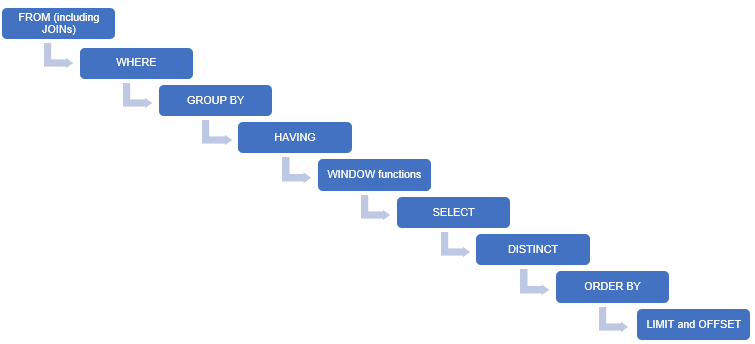

# SQL

## Data Warehouse

1. **Subject-oriented:** A data warehouse should contain information about a few well-defined subjects rather than the enterprise.
2. **Integrated:** A data warehouse is an integrated repository of data. It contains information from various systems within an organisation.
3. **Non-volatile:** The data values in a database cannot be changed without a valid reason.
4. **Time-variant:** A data warehouse contains historical data for analysis.

### Structure of a Data Warehouse

primary methods of designing a data warehouse is **dimensional modelling**.

Two key elements of dimensional modelling:

1. Facts: the numerical data
2. Dimensions: metadata attached to the fact variable

### Star Schema

A schema is an outline of the entire data warehouse. It shows how different data sets are connected and how the different attributes of each data set are used for the data warehouse.

Star Schema is the simplest and most effective schema in a data warehouse. A fact table in the center surrounded by multiple dimension tables resembles a star in the Star Schema model.


The fact table maintains one-to-many relations with all the dimension tables. Every row in a fact table is associated with its dimension table rows with a foreign key reference.

### SETL

**Select:** Identification of the data that you want to analyse

**Extract:** Connecting to the particular data source and pulling out the data

**Transform:** Modifying the extracted data to standardise it

**Load:** Pushing the data into the data warehouse

### Relational Data Model

#### Vocabulary

1. **Tables**

2. **Columns/Attributes**

3. **Constraints:**
   1. **Entity Constraints:** Example an attribute being unique, NULL or PK
   2. **Referential Constraints:** Example foreign key
   3. **Semantic Constraints:** Example data type, max/min length, check or enumeration

### ERD

**Entity-Relationship Diagram**, can be thought of as a map of the database schema. We can visualise the structure of the entire schema and answer the following questions just by looking at the ERD:

- What are the tables that it contains?
- What are the columns that each table contains?
- What is/are the data types and constraint/s (if any) for each column?
- What are the relationships between the various tables?

- **Entity Type/Entity:** It is nothing but a table in the schema. For example, 'orders' and 'payments' are both entity types.
- **Attribute:** It is a column in an entity type. For example, 'orderNumber' is an attribute in the 'orders' entity type.
- **Relationship Types:** They are the lines between the tables. They define the relationships among the tables. These can be of various types based on their **cardinalities**, i.e., one-to-one, one-to-many, many-to-many, etc.

### **Cardinality**

Cardinality refers to the maximum number of times an instance in one entity can relate to instances of another entity.

### **Ordinality/Modality**

Ordinality is the minimum number of times an instance in one entity can be associated with an instance in the related entity

### Common Relationships

1. One --------+-

2. Many --------<-

3. Zero or Many --------o<-

4. One or Many --------+<-

5. One and only One -------++-

6. Zero or One -------o+

**Note:**

1. self-referential relationship -> the table refers to itself.
2. key is a collection of one (simple key) or more attributes (composite key) that helps us identiy a row uniquely in a table.
3. FK will always refer to only one table

## SQL

The commands available in SQL can be broadly categorised as follows:

- Data Definition Language (DDL):

  - Create
  - Alter
  - Drop
  - Rename

- Data Manipulation Language (DML):
  - Insert
  - Update
  - Delete
  - Select
  - Truncate

### SQL commands

DDL

```
-- creates database
create database database_name;
-- creates table
create table table_name ( column_name constraint, ...);

-- alter table by adding column
alter table table_name add column column_name constraint;
-- alter table by deleting column
alter table table_name drop column column_name;
-- alter table by changing an existing column and constraint
alter table table_name change old_column_name new_column_name constraint;

-- drop database
drop database database_name;
-- drop table
drop table table_name;
```

DML

```
-- retrive all attributes of an entity and all rows
select * from table_name;
-- retrive specific attributes of an entity and all rows
select attribute_name, ... from table_name;
-- using count function and alias
select count(*) as alias_name from table_name;
-- filter
select count(*) as alias_name from table_name where condition;
```

[SQL Operators](https://www.w3schools.com/sql/sql_operators.asp)

[MySQL Regular Expression](https://www.geeksforgeeks.org/mysql-regular-expressions-regexp/)

### Nested queries/Subqueries

### Common Table Expression

They are Scope limited.

```
with cte_name as (
   select ...
   from ...
) select ...
from cte_name
where ...
```

### View

They are virtual tables. Not limited by any scope.

```
create view view_name as
select ...
from ...
where ...
```

### Joins

Joins are useful when you want to display attributes from more than one table.

### Inner Join

It's possible to perform inner joins between the tables when they have an FK referential constraint. It retives the common values or the intersections between the two tables.

```
select <column_1>, <column_2>, ...
from table_1 a
inner join table_2 b
on a.<common_column> = b.<common_column>;
```

### Outer Join

1. **Left Outer Join:** Retrives all the values from the left side table and non existent values are filled with null.
2. **Right Outer Join:** Retrives all the values from the right side table and non existent values are filled with null.

```
select <column_1>, <column_2>, ...
from table_1 a
left join table_2 b
on a.<common_column> = b.<common_column>;
```

### SQL Set Operations

We can perform set operations such as union, intersect and minus on the result of two queries.
Two tables are union-compatible if:

1. They have the same number of attributes, and
2. The attribute types are compatible, i.e., the corresponding attributes have the same data type.

**Note:** union will not show duplicate whereas, union will show duplicates

## Window Functions

### Rank Functions

- **RANK():** Rank of the current row within its partition, with gaps

```
RANK() OVER (
  PARTITION BY <expression>[{,<expression>...}]
  ORDER BY <expression> [ASC|DESC], [{,<expression>...}]
)
```

- **DENSE_RANK():** Rank of the current row within its partition, without gaps

```
DENSE_RANK() OVER (
  PARTITION BY <expression>[{,<expression>...}]
  ORDER BY <expression> [ASC|DESC], [{,<expression>...}]
)
```

- **PERCENT_RANK():** Percentage rank value, which always lies between 0 and 1

```
PERCENT_RANK() OVER (
  PARTITION BY <expression>[{,<expression>...}]
  ORDER BY <expression> [ASC|DESC], [{,<expression>...}]
)
```

- **ROW_NUMBER():** Assigns unique numeric values to each row, starting from 1.

```
ROW_NUMBER() OVER (
  PARTITION BY <expression>[{,<expression>...}]
  ORDER BY <expression> [ASC|DESC], [{,<expression>...}]
)
```

### Named Windows

The order in which the various SQL statements appear in a query is as follows:

1. SELECT
2. FROM
3. JOIN
4. WHERE
5. GROUP BY
6. HAVING
7. WINDOW
8. ORDER BY

```
WINDOW window_name AS (window_spec)
  [, window_name AS (window_spec)] ...
```

### Frames


### Lead and Lag Functions

```
LEAD(expr[, offset[, default]])
  OVER (Window_specification | Window_name)
```

```
LAG(expr[, offset[, default]])
  OVER (Window_specification | Window_name)
```

### Case

Case statements are used to classify data values into different groups according to the given criteria.

```
CASE
  WHEN condition1 THEN result1
  WHEN condition2 THEN result2
  .
  .
  WHEN conditionN THEN resultN
  ELSE result
END AS column_name;
```

### UDF

UDFs are used to create and reuse certain pieces of functionality in SQL.
User Defined Functions

- The CREATE FUNCTION is also a DDL statement.
- The function body must contain one RETURN statement.

```
DELIMITER $$

CREATE FUNCTION function_name(func_parameter1, func_parameter2, ...)
  RETURN datatype [characteristics]
/*      func_body      */
  BEGIN
    <SQL Statements>
    RETURN expression;
END ; $$

DELIMITER ;
```

### Stored Procedure

Stored procedures are also used to reuse some required functionality in SQL.

```
DELIMITER $$

CREATE PROCEDURE Procedure_name (<Paramter List>)
BEGIN
  <SQL Statements>
END $$

DELIMITER ;

CALL Procedure_name;
```

### UDF vs Stored Procedure

| UDF                                                   | Stored Procedure                                       |
| ----------------------------------------------------- | ------------------------------------------------------ |
| It supports only the input parameter, not the output. | It supports input, output and input-output parameters. |
| It cannot call a stored procedure.                    | It can call a UDF.                                     |
| It can be called using any SELECT statement.          | It can be called using only a CALL statement.          |
| It must return a value.                               | It need not return a value.                            |
| Only the 'select' operation is allowed.               | All database operations are allowed.                   |

### Cursors

A cursor is used to individually process each row that is returned in a query.

### Best Practices

- Comment your code by using a hyphen (-) for a single line and (/_ ... _/) for multiple lines of code.

- Always use table aliases when your query involves more than one source table.

- Assign simple and descriptive names to columns and tables.

- Write SQL keywords in upper case and the names of columns, tables and variables in lower case.

- Always use column names in the 'order by' clause, instead of numbers.

- Maintain the right indentation for different sections of a query.

- Use new lines for different sections of a query.

- Use a new line for each column name.

- Use the SQL Formatter or the MySQL Workbench Beautification tool (Ctrl+B).

### Indexing

Indexing is an effective way to optimise query execution, as it selects the required data values instead of processing the entire table. The syntaxes for creating, adding and dropping an index are as follows:

```
CREATE INDEX index_name
ON table_name (column_1, column_2, ...);
-- or
ALTER TABLE table_name
ADD INDEX index_name(column_1, column_2, ...);
-- drop index
ALTER TABLE table_name
DROP INDEX index_name;
```

### Clustered vs Non-Clustered Indexing

The major differences between clustered and non-clustered indexing are summarised in the table given below.
| Clustered Index | Non-Clustered Index |
| -------------------------------------------- | ------------------------------------------------------------------ |
| This is mostly the primary key of the table. | This is a combination of one or more columns of the table. |
| It is present within the table. | The unique list of keys is present outside the table. |
| It does not require a separate mapping. | The external table points to different sections of the main table. |
| It is relatively faster. | It is relatively slower. |

### Order of Execution

The order in which the different SQL statements are executed in a query is depicted in the diagram given below.

